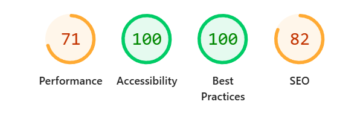
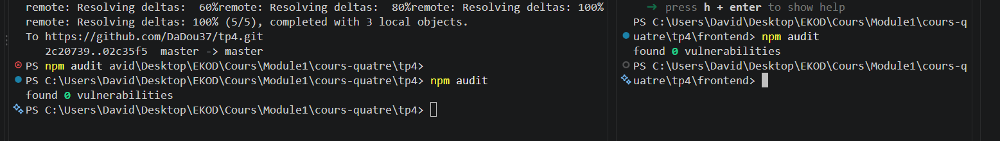
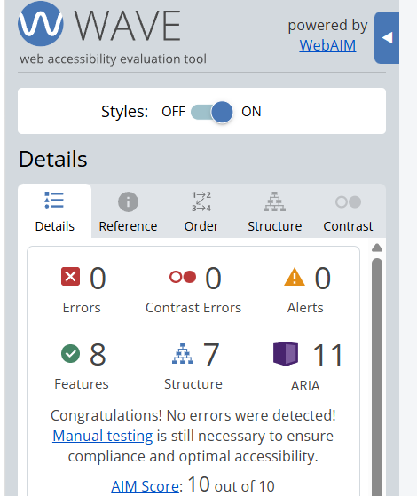

## API Tasks

API REST réalisée avec node.js, Express et PostgreSQL, avec une environnement Docker. 
L'application permet de créer, consulter, modifier et supprimer des tâches. Une tâche peut également être associée à un bénévole grâce à son prénom.

## Installation 

Installer les dépendance:
- npm install

Lancer le projet: 
- docker compose up -d --build

L'api est disponible sur: 
- http://localhost:3000

### Routes disponibles

| Méthode | Route                     | Description                    |
| ------- | ------------------------- | ------------------------------ |
| GET     | `/tasks`                  | Récupérer toutes les tâches    |
| GET     | `/tasks?status=completed` | Récupérer les tâches terminées |
| GET     | `/tasks?status=pending`   | Récupérer les tâches en cours  |
| POST    | `/tasks`                  | Créer une tâche                |
| PUT     | `/tasks/:id`              | Modifier une tâche             |
| PATCH   | `/tasks/:id/completed`    | Modifier le statut d'une tâche |
| PATCH   | `/tasks/:id/assignee`     | Retirer le bénévole            |
| DELETE  | `/tasks/:id`              | Supprimer une tâche            |

---

Démarrer le Frontend:

- npm run dev 

il démarre sur le: 
- http://localhost:5173

## Base de donnée

Les informations de connexion à PostgreSQL sont stockées dans un fichier `.env` à la racine du projet.

Le fichier `.env` contient des informations sensibles et ne doit pas être versionné.

Un fichier `.env.example` est fourni avec des valeurs fictives.

Les données sont stocké dans PostegreSQL grâce au volume docker 

La base de données utilisée est **PostgreSQL**.

PostgreSQL est lancé dans un conteneur Docker.

Les données sont conservées grâce à un volume Docker.

Elle contient notamment :

| Champ       | Type         | Description             |
| ----------- | ------------ | ----------------------- |
| `id`        | INTEGER      | Identifiant de la tâche |
| `title`     | VARCHAR(255) | Titre de la tâche       |
| `completed` | BOOLEAN      | État de la tâche        |
| `assignee`  | VARCHAR(50)  | Prénom du bénévole      |

---

## Validation des données

Les données reçues par l'API sont validées avec **Joi**.

### Variables d'environnement

Les informations sensibles ne sont pas écrites directement dans le code.

Le fichier `.env` est exclu du dépôt Git grâce au `.gitignore`.

Un fichier `.env.example` contenant uniquement des valeurs fictives est fourni.

### Audit des dépendances

Les dépendances peuvent être vérifiées avec :

npm audit

Pour le frontend :

cd frontend
npm audit

---

## RGPD

### Finalité du traitement

Le prénom du bénévole est utilisé uniquement pour identifier la personne chargée d'une tâche.

### Données collectées

L'application collecte uniquement :

* le prénom du bénévole
* maximum 50 caractères

L'application ne demande pas de nom de famille, numéro de téléphone ou adresse e-mail pour cette fonctionnalité.

### Conservation

Le prénom est conservé avec la tâche.

Lorsque la tâche est supprimée, le prénom associé est également supprimé.

Le prénom peut également être supprimé avant la suppression de la tâche grâce au bouton :

**« Retirer le bénévole »**

### Accès aux données

Les données sont accessibles uniquement aux utilisateurs autorisés à utiliser l'application de gestion des tâches.

## Projet pédagogique

Ce projet a été réalisé dans le cadre d'un apprentissage du développement d'une application web complète avec :

* API REST
* base de données PostgreSQL
* Docker
* frontend React
* validation des données
* accessibilité
* sécurité
* protection contre les injections SQL et les XSS
* prise en compte du RGPD
* gestion du code avec Git

## Tests qualité et accessibilité

### Lighthouse

### npm audit - API - Frontend

### wave

